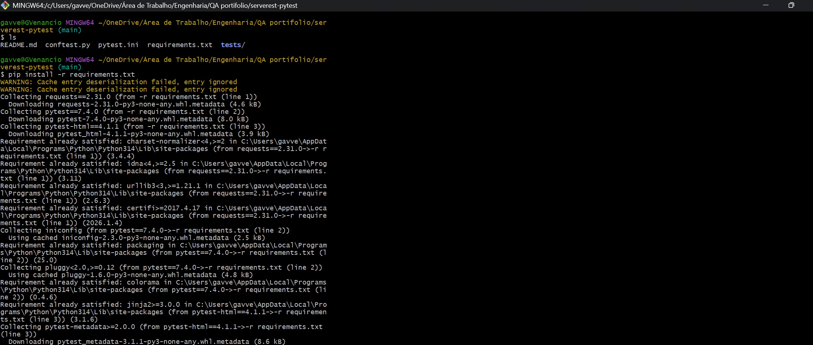
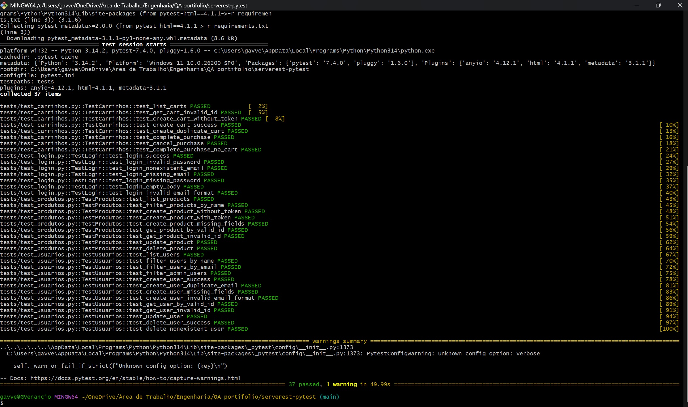
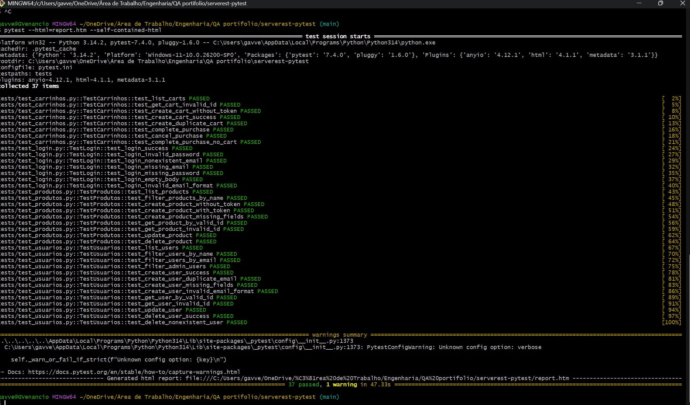
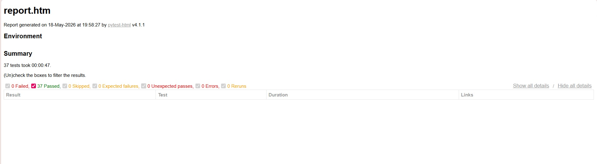

# 🧪 ServeRest API — Test Automation with Pytest


Automated API test suite for the [ServeRest](https://serverest.dev) REST API, built with Python and Pytest.
ServeRest simulates a virtual store and is widely used for API testing practice.

---

## 📊 Project Summary

| Item | Result |
|---|---|
| Total Automated Tests | 37 |
| Modules Covered | 4 (Login, Users, Products, Carts) |
| Test Failures | 0 |
| Test Types | Positive & Negative scenarios |
| Execution Time | 47 seconds |
| Report Format | HTML (pytest-html) |
| Status | Active |

---

## 📋 Project Overview

This project demonstrates automated API testing across all ServeRest endpoints, covering:

- ✅ 37 automated test cases — 0 failures
- ✅ Positive and negative scenarios
- ✅ Token-based authentication with session fixtures
- ✅ Unique data generation to avoid conflicts in shared environments
- ✅ HTML report generation with pytest-html

---

## 🧠 Key Technical Decisions

- **Session fixtures** — token generated once per session and reused across all tests, avoiding repeated login calls and improving overall performance
- **UUID data generation** — prevents conflicts in the shared ServeRest environment where multiple users test simultaneously, ensuring test isolation and repeatability
- **Modular structure** — one test file per endpoint for easier maintenance, clearer coverage visibility, and independent execution per module
- **Positive & negative scenarios** — every module covers both happy path and edge cases (missing fields, invalid IDs, duplicate data, unauthorised access)

---

## 📂 Project Structure

```
serverest-pytest/
│
├── conftest.py           # Global fixtures (auth token, headers)
├── pytest.ini            # Pytest configuration
├── requirements.txt      # Project dependencies
├── README.md             # Project documentation
│
└── tests/
    ├── test_login.py     # Login endpoint tests
    ├── test_usuarios.py  # Users endpoint tests
    ├── test_produtos.py  # Products endpoint tests
    └── test_carrinhos.py # Carts endpoint tests
```

---

## 🧪 Test Coverage

| Module | Tests | Scenarios |
|---|---|---|
| Login | 7 | Valid login, invalid password, missing fields, empty body |
| Users | 13 | List, filter, create, get by ID, update, delete |
| Products | 9 | List, filter, create with/without token, get, update, delete |
| Carts | 8 | List, create, duplicate cart, invalid ID, checkout, cancel |
| **Total** | **37** | **Positive and negative scenarios** |

---

## ⚙️ How to Install and Run

### 1. Clone the repository
```bash
git clone https://github.com/gislaine-venancio/serverest-pytest.git
cd serverest-pytest
```

### 2. Create a virtual environment
```bash
python -m venv venv
source venv/bin/activate        # Mac/Linux
venv\Scripts\activate           # Windows
```

### 3. Install dependencies
```bash
pip install -r requirements.txt
```



### 4. Run all tests
```bash
pytest
```

### 5. Run with HTML report
```bash
pytest --html=report.html --self-contained-html
```

### 6. Run a specific module
```bash
pytest tests/test_login.py
pytest tests/test_produtos.py
```

---

## 📊 Test Results

### Terminal Output — 37 passed, 0 failed



---

### Generating HTML Report



---

### HTML Report — pytest-html



> **37 tests — 0 Failed — 0 Errors — completed in 47s**

---

## 🔧 Tech Stack

| Tool | Purpose |
|---|---|
| Python 3.14 | Programming language |
| Pytest 7.4 | Test framework |
| Requests | HTTP client for API calls |
| pytest-html | HTML report generation |
| Git / GitHub | Version control |

---

## 🔗 Related Projects

| Project | Type | Tools |
|---|---|---|
| [ServeRest API Testing — Postman](https://github.com/gislaine-venancio/ServeRest_API-testing) | Manual API Testing | Postman, Jira, Excel |

---

## 👩‍💻 Author

**Gislaine Venancio** — QA Engineer
📧 gav.venancio@outlook.com
💼 [LinkedIn](https://www.linkedin.com/in/gislaine-venancio)
🐙 [GitHub](https://github.com/gislaine-venancio)

---

> 💡 *This project is part of my QA portfolio demonstrating test automation skills using Python and Pytest.*
